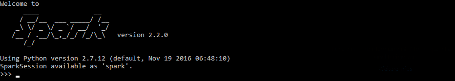
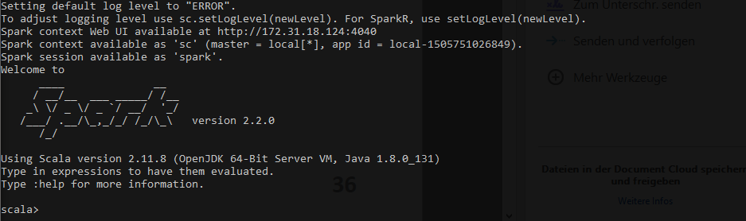

```{r setup, include=FALSE, warning=FALSE}
knitr::opts_chunk$set(echo=TRUE)
```

```{r global_options, include=FALSE}
knitr::opts_chunk$set(warning=FALSE, message=FALSE,
                      tidy.opts=list(width.cutoff=60), fig.pos='H',
                      fig.align='center')
```

# Introduction
The following assignement is concerned with the installation and application of Apache Spark. Spark is an open-source cluster-computing framework which provides programmers with an application programming interface centered on a data structure called the resilient distributed dataset (RDD), a read-only multiset of data items distributed over a cluster of machines, that is maintained in a fault-tolerant way. It was developed in response to limitations in the MapReduce cluster computing paradigm, which forces a particular linear dataflow structure on distributed programs: MapReduce programs read input data from disk, map a function across the data, reduce the results of the map, and store reduction results on disk. Spark provides an interface for programming entire clusters with implicit data parallelism and fault-tolerance.

Spark is implemented in Scala (a Java dialect) and accessible from software written in other languages such as Python or R. 

# Problem 1 (20%)
Create your own Virtual Machine with a Linux operating system. The lecture notes speak about CentOS. You are welcome to work with another Linux OS. When creating the VM, create an administrative user. Call that user whatever you feel like.

## Create AWS instance
As stated on Piazza, instead of using a VM it is also possible to create a AWS instance. Spark is a cluster-computing framework. Because of this, a sensible approach is to install it on AWS in order to leverage those cluster capabilities.

**Note:** There are in principal two ways starting up a AWS instance, one is working with the web based *point and click* interface and the other is to use the *command-line interface (CLI)*. We're using the second option here. The reason for this is, that when working with clusters using a startup script can be significantly faster and is more fault-tolerant than configuring the cluster by hand. 

#### Step 1: Installing AWS CLI
First, we have to install the AWS CLI on the local bash client (e.g., WSL for Windows, terminal on Linux, etc.)
```{bash eval=FALSE}
sudo apt install awscli -y
```

#### Step 2: Configure AWS CLI
Second, we have to configure the AWS CLI, in order to do this, a user has to be created under: https://console.aws.amazon.com/iam/home#/users. With the information of the user data the AWS CLI can be configured.

```{bash eval=FALSE}
# configuring AWSCLI
aws configure

# 1. enter your Access Key ID
# 2. enter your Secret Access Key
# 3. choose region close to you [*] (e.g., "eu-central-1")
# 4. enter "json"
```

#### Step 3: Creating a SSH Key pair
In order to ssh into the AWS instance, a SSH Key has to be created and downloaded:
```{bash eval=FALSE}
# Creat SSH Key pair
aws ec2 create-key-pair --region eu-central-1 --key-name aws-instance \
    --query "KeyMaterial" --output text > SSH/aws-instance.pem
```

#### Step 4: Network & Security
Next we're setting up the network and security settings. Out of convinience, we're allowing all IP addresses to access our AWS Server. We're also oppening the port 22 (ssh), 80 (http), 443 (https), 8787 (rstudio).
```{bash eval=FALSE}
# set MYIP to external IP address
MYIP=$(curl -s http://myip.dnsomatic.com | grep -P '[\d.]')

# set ALLIP to 0.0.0.0/0
ALLIP="0.0.0.0/0"

echo $MYIP
echo $ALLIP

# create a new security group and save its returned ID to SGID
SGID=$(aws ec2 create-security-group --group-name aws-sec-group \
       --description "aws security group" --region eu-central-1)

# allow all IP's access to ports
aws ec2 authorize-security-group-ingress --group-name aws-sec-group \
    --protocol tcp --port 22 --cidr $ALLIP --region eu-central-1
aws ec2 authorize-security-group-ingress --group-name aws-sec-group \
    --protocol tcp --port 80 --cidr $ALLIP --region eu-central-1
aws ec2 authorize-security-group-ingress --group-name aws-sec-group \
    --protocol tcp --port 8787 --cidr $ALLIP --region eu-central-1
aws ec2 authorize-security-group-ingress --group-name aws-sec-group \
    --protocol tcp --port 443 --cidr $ALLIP --region eu-central-1
```

#### Step 5: Launch EC2 Instance
With the above network and security settings we're launching a free-tier Ubuntu 16.04 Ubuntu instance. The only change that is done to the default settings is to increase the root disk space from 8GB to 32GB. 

```{bash eval=FALSE}
# Launch Instance (Ubuntu 16.04)
aws ec2 run-instances \
    --image-id ami-1e339e71 \
    --count 1 \
    --instance-type t2.micro \
    --key-name aws-instance \
    --security-group-ids aws-sec-group \
    --region eu-central-1 \
    --block-device-mapping "[ { \"DeviceName\": \"/dev/sda1\", \"Ebs\": { \"VolumeSize\": 32 } } ]"
```


```{bash eval=FALSE echo=FALSE}
# Start/Stop Instance 
aws ec2 start-instances --instance-ids i-0d52c859a139da090
aws ec2 stop-instances --instance-ids i-0d52c859a139da090
```

#### Step 6: Associate IP Address 
The started instance has currently a *flexible* ip address. This means, that when restarting the instance, a new ip address gets associated to the server. In order to avoid this, we can associate a elastic ip address to the server. First we're reading the id of our instance and the bought elastic ip address.

```{bash}
 # Get instances id and ip
aws ec2 describe-instances --query \
  'Reservations[*].Instances[*].[InstanceId,Tags[?Key==`Name`].Value|[0],State.Name,PrivateIpAddress,PublicIpAddress]' \
  --output text | column -t
```
```{bash}
# Get elastic IP addresses
aws ec2 describe-addresses
```

With the above instance id (i-0d52c859a139da090) and elastic ip id (eipalloc-a26c62cb) we can associate the IP address.

```{bash eval=FALSE}
# Associate IP address
aws ec2 associate-address --instance-id i-0d52c859a139da090 --allocation-id eipalloc-a26c62cb
```

#### Step 7: SSH into EC2 Instance
Having associated instance ip (52.57.149.55) we can now ssh into the server. 

```{bash eval=FALSE}
# SSH into instance
ssh -i SSH/aws-instance.pem ubuntu@52.57.149.55
```

#### Step 8: Add user
We're next adding a new user and are coping the ssh key to that user.
```{bash eval=FALSE}
# Add new user
sudo adduser tim
sudo adduser tim sudo

# Copy ssh key
sudo mkdir /home/tim/.ssh
sudo cp /home/ubuntu/.ssh/authorized_keys \
    /home/tim/.ssh/authorized_keys
sudo cp /home/ubuntu/.ssh/authorized_keys \
    /home/tim/.ssh/authorized_keys
sudo chown tim -R /home/tim/.ssh
sudo chmod 700 /home/tim/.ssh
sudo chmod 600 /home/tim/.ssh/authorized_keys
```

#### Step 9: Enable Swapping (optional)
It might be necessary to enable swapping. This is especially the case with the smaller instances.

```{bash eval=FALSE}
sudo /bin/dd if=/dev/zero of=/var/swap.1 bs=1M count=2048
sudo /sbin/mkswap /var/swap.1
sudo chmod 600 /var/swap.1
sudo /sbin/swapon /var/swap.1
```

#### Step 10: Install RStudio Server (optional)
In order to facilitate working with the spark instance, the RStudio Server IDE can be installed. The following bash script facilitates the installation. 

```{bash eval=FALSE}
wget https://cdn.rawgit.com/greenore/linux-setup/7d25ec0c/setup_rstudio.sh
chmod +x setup_rstudio.sh
sudo ./setup_rstudio.sh
```

#### Step 10: Install Java and Scala
Next we have to install java as spark is dependend on a correct java installation. We're also installing the sbt client 
```{bash eval=FALSE}
# Install OpenJDK and scala
sudo apt install default-jre default-jdk scala -y

# Install sbt
echo "deb https://dl.bintray.com/sbt/debian /" | sudo tee -a /etc/apt/sources.list.d/sbt.list
sudo apt-key adv --keyserver hkp://keyserver.ubuntu.com:80 --recv 2EE0EA64E40A89B84B2DF73499E82A75642AC823
sudo apt-get update
sudo apt install sbt -y
```

## SCP file transfer
Once the VM is created transfer the attached text file Ulysses10.txt to the home of new user. You can do it using scp (secure copy command) or email.

In order to transfer the file from the local computer to the server we're opening second terminal on the local computer and are executing the following command:
```{bash eval=FALSE}
scp -i SSH/aws-instance.pem \
  /mnt/c/Local/Education/e63-coursework/hw3/data/ulysses10.txt \
  tim@52.57.149.55:~/.
```

## Java, Python and Scala version
Examine the version of Java, Python and Scala on your VM. If any of those versions is below requirements for Spark 2.2 install proper version. Set JAVA_HOME environmental variable. Set your PATH environmental variable properly, so that you can invoke: java, sbt and python commands from any directory on your system.

#### Spark version check
Spark runs on Java 8+, Python 2.7+/3.4+ and R 3.1+. For the Scala API, Spark 2.2.0 uses Scala 2.11. As we're not going to use the scala API, the sbt client doesn't need to be installed.

#### Get Java version
```{bash}
java -version
```

#### Get Python version
```{bash}
python -V
```

#### Get R version
```{bash}
R --version
```

#### Get Scala version
```{bash}
scala -version
```

#### Get Sbt version
```{bash eval=FALSE}
sbt sbtVersion
```

```{r, echo=FALSE}
cat("[info] Loading project definition from /home/tim/project")
cat("[info] Set current project to tim (in build file:/home/tim/")
cat("[info] 1.0.1")
```

The above outputs show, that the necessary software is up to date. Next we're setting the necessary path variables for JAVA_HOME. In order to do this we're creating a bash_profile file with the following content:

```{bash eval=FALSE}
# Get the aliases and functions
if [ -f ~/.bashrc ]; then
	. ~/.bashrc
fi

# JAVA_HOME environment
JAVA_HOME=/usr/lib/jvm/java-8-openjdk-amd64/jre/
export JAVA_HOME

PATH=$PATH:$JAVA_HOME/bin
export PATH
```

That file has to be sourced in order to be effective.
```{bash eval=FALSE}
source ~/.bash_profile
```

# Problem 2 (15%)
Install Spark 2.2 on your VM. Make sure that pyspark is also installed. Demonstrate that you can successfully open spark-shell and that you can eliminate most of WARNing messages.

## Install Spark
There are multible ways to install spark on the EC2 instance. An easy way would be to use the spark_install function inside the sparklyr package. We're using the default installation process trough downloading the tgz file from apache.

```{bash eval=FALSE}
# Download Spark
sudo wget https://d3kbcqa49mib13.cloudfront.net/spark-2.2.0-bin-hadoop2.7.tgz

# Unpack Spark in the /opt directory
sudo tar zxvf spark-2.2.0-bin-hadoop2.7.tgz -C /opt
```

Next we have to add SPARK_HOME to the bash_profile file. The new file is going to look like this:

```{bash eval=FALSE}
# Get the aliases and functions
if [ -f ~/.bashrc ]; then
	. ~/.bashrc
fi

# JAVA_HOME environment
JAVA_HOME=/usr/lib/jvm/java-8-openjdk-amd64/jre/
export JAVA_HOME

SPARK_HOME=/opt/spark-2.2.0-bin-hadoop2.7/
export SPARK_HOME

PATH=$PATH:$JAVA_HOME/bin:$SPARK_HOME/bin
export PATH
```

That file has to be sourced in order to be effective.
```{bash eval=FALSE}
source ~/.bash_profile
```

## Check Pyspark
In order to check if pyspark is correctly installed we can run the pyspark command
```{bash eval=FALSE}
pyspark
```

```{r echo=FALSE}

```
The image above shows, that pyspark runs correctly.

## Eliminate warning
Demonstrate that you can successfully open spark-shell and that you can eliminate most of WARNing messages.

In order to eliminate the error messages we're first renaming the log4j.properties file and setting the log level to ERROR and log4j.rootCategory=ERROR.

```{bash eval=FALSE}
# Rename log4j.properties
sudo mv /opt/spark-2.2.0-bin-hadoop2.7/conf/log4j.properties.template \
  /opt/spark-2.2.0-bin-hadoop2.7/conf/log4j.properties

# Edit file
sudo nano /opt/spark-2.2.0-bin-hadoop2.7/conf/log4j.properties
```

## Check Pyspark
In order to check if the error messages disapeared from spark-shell we can run the following command: 
```{bash eval=FALSE}
spark-shell
```

```{r echo=FALSE}

```
The image above shows, that pyspark runs correctly.

# Problem 3 (15%)
Find the number of lines in the text file ulysses10.txt that contain word *“afternoon”* or *“night”* or *“morning”*. In this problem use RDD API. Do this in two ways, first create a lambda function which will test whether a line contains any one of those 3 words.


#### Load Spark
```{bash}
sudo /opt/spark-2.2.0-bin-hadoop2.7/sbin/start-master.sh
sudo /opt/spark-2.2.0-bin-hadoop2.7/sbin/stop-master.sh
```

#### Count lines (RDD)
```{python eval=FALSE"}
lines = sc.textFile("/home/tim/ulysses10.txt")
lines.count()
```

#### Count lines (Dataset)
```{python eval=FALSE"}
lines = spark.read.text("/home/tim/ulysses10.txt")
lines.count()
```

#### Filter words (RDD)
```{python eval=FALSE"}
lines = sc.textFile("/home/tim/ulysses10.txt")
heaven = lines.filter(lambda line: "heaven" in line)
heaven.count()
```

#### Filter words (Dataframe)
```{python eval=FALSE"}
dset = spark.read.text("/home/tim/ulysses10.txt")
heavens = dset.filter(dset.value.contains('heaven'))
heavens.count()
```

#### Lambda functions

```{python eval=FALSE"}
def hasLife(line):
  return "life" in line # At the beginning hit a tab


lines = sc.textFile("file:///home/tim/ulysses10.txt")
lifeLines = lines.filter(hasLife)
lifeLines.count()
print lifeLines.first()

```


```{bash}
$SPARK_HOME/bin/spark-submit /scripts/python/your_script.py
```


#### Install findspark
```{bash}
sudo -H pip install findspark 
sudo -H pip install --upgrade pip
```

#### Lambda functions
```{python eval=FALSE"}
# Import findspark
import findspark
findspark.init()

# Or the following command
findspark.init("/opt/spark-2.2.0-bin-hadoop2.7")

from pyspark import SparkContext, SparkConf

conf = SparkConf().setMaster("local").setAppName("MyApp")
sc = SparkContext(conf = conf)

lines = sc.textFile("file:///home/tim/ulysses10.txt")
tofday  = lines.filter(lambda line: "night" in line or "morning" in line or "afternoon" in line)
print "Number of lines with 'night', 'morning', 'afternoon' :"
print tofday.count()
```

```{bash}
spark-submit /home/tim/e63-coursework/hw3/scripts/python/lambda_count.py
```

## Initialize
In the following steps we're working heavily in a R environment. In order to set up that environment, the following R code has to be executed. This loads all the necessary packages and functions for the following steps.

```{r init, message=FALSE}
## Options
options(scipen = 10)                          # Disable scientific notation
update_package <- FALSE                       # Use old status of packages

## Init files (always execute, eta: 10s)
source("scripts/01_init.R")                   # Helper functions to load packages
source("scripts/02_packages.R")               # Load all necessary packages
source("scripts/03_functions.R")              # Load project specific functions
```


```{r}
sc <- spark_connect(spark_home="/opt/spark-2.2.0-bin-hadoop2.7/",
                    master="local")
tbl_ulysses <- spark_read_csv(sc, name="tbl_ulysses",
                              header=FALSE, path="data/ulysses10.txt", delimiter = )

tbl_ulysses <- spark_read_source(sc, name="tbl_ulysses",
                                 source="data/ulysses10.txt")


?spark_read_source
count_lines <- function(sc, path) {
  spark_context(sc) %>% 
    invoke("textFile", path, 1L) %>% 
      invoke("count")
}

count_lines(sc, tbl_ulysses)


```


```{python}
# Import 
from pyspark import SparkConf, SparkContext

conf = SparkConf().setMaster("local").setAppName("MyApp")
sc = SparkContext(conf = conf)
tim@ip-172-31-18-124:~/e$


sc.textFile('file.csv')
    .map(lambda line: (line.split(',')[0], line.split(',')[1]))
    .collect()

lines = sc.textFile("file:///home/tim/63-coursework/hw3/data/ulysses/ulysses10.txt")
tofday  = lines.filter(lambda line: "night" in line or "morning" in line or "afternoon" in line)
print "Number of lines with 'night', 'morning', 'afternoon' :"
print tofday.count()
```


Second, create a named function in the language of choice that returns TRUE if a line passed to it contains any one of those three words. Demonstrate that the count is the same. Use pyspark and Spark Python API. If convenient you are welcome to implement this problem in any other language: Scala, Java or R.


# Problem 4 (15%)
Implement the above task, finding the number of lines with one of those three words in file ulysses10.txt using Dataset/DataFrame API. Again, use the language of your choice.

# Problem 5 (15%)
Create a standalone Python script that will count all words in file ulysses10.txt. You are expected to produce a single number. Do it using RDD API. If convenient, you are welcome to implement this problem in other languages: Scala, Java or R.

# Problem 6 (15%)
Create a standalone Python script that will count all words in file ulysses10.txt. You are expected to produce a single number. Do it using Dataset/DataFrame API. If convenient, you are welcome to implement this problem in other languages: Scala, Java or R.
